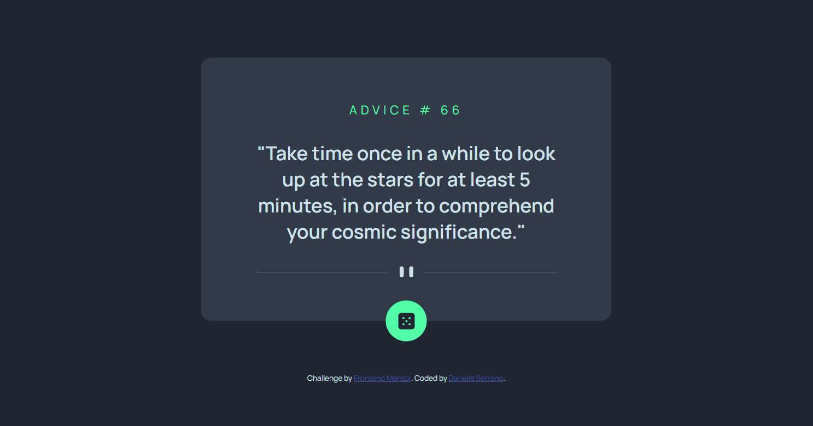

# Frontend Mentor - Advice generator app solution

This is a solution to the [Advice generator app challenge on Frontend Mentor](https://www.frontendmentor.io/challenges/advice-generator-app-QdUG-13db). Frontend Mentor challenges help you improve your coding skills by building realistic projects.

## Table of contents

- [Overview](#overview)
  - [The challenge](#the-challenge)
  - [Screenshot](#screenshot)
  - [Links](#links)
- [My process](#my-process)
  - [Built with](#built-with)
  - [What I learned](#what-i-learned)
  - [Continued development](#continued-development)
  - [Useful resources](#useful-resources)
- [Author](#author)
- [Acknowledgments](#acknowledgments)

## Overview

### The challenge

Users should be able to:

- View the optimal layout for the app depending on their device's screen size
- See hover states for all interactive elements on the page
- Generate a new piece of advice by clicking the dice icon

### Screenshot



### Links

- Solution URL: [Advice-generator](https://github.com/danielaser/advice-generator)
- Live Site URL: [Advice-generator-API](https://advice-generator-api-connection.netlify.app/)

## My process

### Built with

- Semantic HTML5 markup
- CSS custom properties
- Flexbox
- Mobile-first workflow
- Vanilla JavaScript
- [Styled Components](https://styled-components.com/) - For styles

### What I learned

To complete this challenge I decided to use the XMLHttpRequest. There are many ways to do it but I chose that one because I wanted to start with the very basic. I learned more about the methods like GET and the onload request.

To see how GET works, see below:

```js
const request = new XMLHttpRequest();
request.open('GET', 'https://api.adviceslip.com/advice', true);

request.onload = function () {
  //see the complete code in the repository
}
```

### Continued development

I would like to continue my learning with a framework as React.

### Useful resources

- [Tutorial Api Javascript](https://www.neoguias.com/tutorial-api-javascript/) - This is an amazing article which helped me finally understand how to connect the API with XMLHttpRequest. I'd recommend it to anyone still learning this concept.


## Author

- Website - [Daniela Serrano](https://github.com/danielaser)
- Frontend Mentor - [@danielaser](https://www.frontendmentor.io/profile/@danielaser)

## Acknowledgments

As a junior developer I find a good documentation and examples that can help everyone who wants to build or add components to a project. There are many sides that can help us to find solutions and to use better programming practices [Useful resources](#useful-resources).
